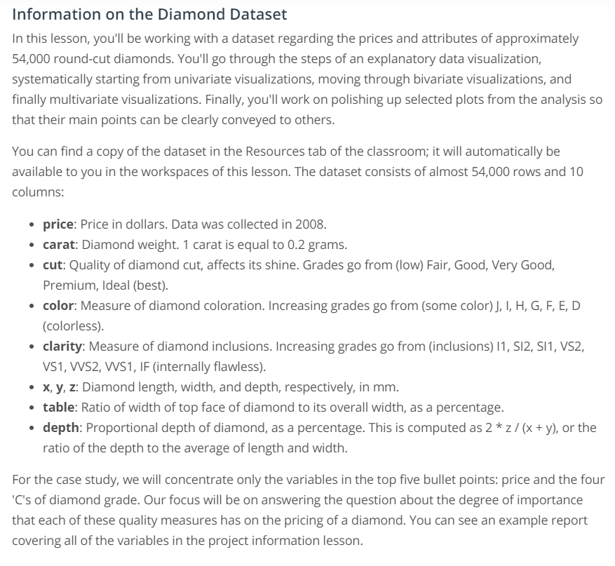

# Diamond Data Visualisation Project

## Table of Contents
1. [Description](#Description)
2. [File Description](#FileDescription)
3. [Author](#Author)
4. [Acknowledgements](#Acknowledgements)

## Description 
The purpose of this project is to study and practice data visualisation using python. The project was designed by [Udacity](https://www.udacity.com/) for its students. 

The project consists of four parts:
- Univariate Exploration
- Bivariate Exploration
- Multivariate Exploration
- Explanatory Polishing

Details of data and project were given by Udacity as below:

## File Description 
|- README.md
|- 1. Univariate_Exploration.ipynb      - Univariate visualisation worksheet
|- 2. Bivariate_Exploration.ipynb       - Bivariate visualisation worksheet
|- 3. Multivariate_Exploration.ipynb    - Bivariate visualisation worksheet
|- 4. Explanatory_Polishing.ipynb       - Visualisation polishing worksheet
|- diamond.csv                          - Dataset
|- DataMetaData.png                     - Details of data and project

## Author 
[Yougun Han](https://www.linkedin.com/in/yougun-han/)

## Acknowledgements 
I would like to thank Udacity for designing the project.